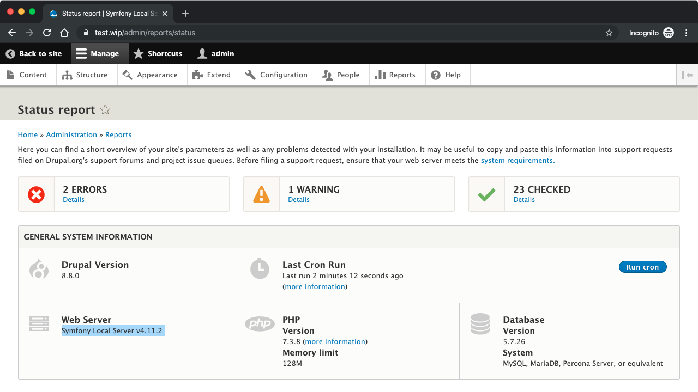

# Testing the Symfony Local Server with Drupal

An example of running Drupal 8.8 on Symfony’s [local web server][docs].

[docs]: https://symfony.com/doc/current/setup/symfony_server.html



## Usage

1. Install the Symfony CLI from <https://symfony.com/download>.
1. Clone this repository
    ```bash
    git clone https://github.com/opdavies/symfony-server-drupal-test.git

    cd symfony-server-drupal-test
    ```
1. Run `composer install` to download all of the project’s dependencies (Drupal core, Examples module etc).
1. Run `docker-compose up -d` to start the Docker container for MySQL. (You can run `docker-compose ps` afterwards to confirm that it’s running).
1. Run `symfony server:start` to start the web server.
1. Use Drush to install Drupal, prefixed by `symfony php` to allow access to the environment variables needed in `settings.php`:
    ```bash
    cd web

    symfony php ../vendor/bin/drush site:install --no-interaction
    ```
1. Go to http://127.0.0.1:8000 to view the site.
1. To run tests, PHPUnit also needs to be prefixed with `symfony php`:
    ```bash
    cd web

    symfony php ../vendor/bin/phpunit -c core core/modules/action
    ```
1. Run `symfony server:stop` to stop the web server.
